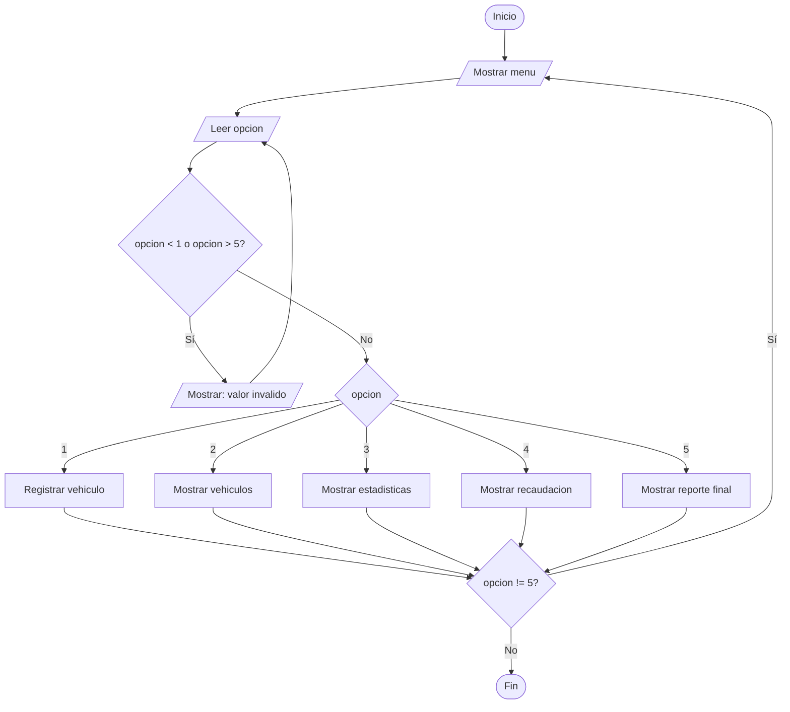
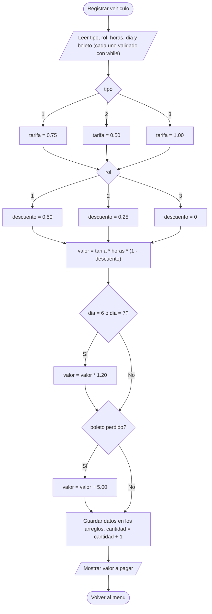

## Integrantes

- Francis Bonifaz
- Sebastian Navas
- David Punina
- Dixon Prado

## Objetivo

Desarrollar y fortalecer el conocimiento sobre el uso de ciclos en Java, aplicando estructuras repetitivas como `while`, `do-while` y `for` para resolver diferentes problemas mediante programas sencillos y prácticos.

## Descripción de los ejercicios

## Ejercicio 10. Sistema integrador de parqueadero

Construya una aplicación completa utilizando:

```
===================================
  PARQUEADERO UNIVERSITARIO
===================================
1. Registrar vehículo
2. Mostrar vehículos registrados
3. Mostrar estadísticas
4. Mostrar recaudación
5. Salir
===================================
```

Por cada vehículo registrar:

- tipo de vehículo;
- rol: estudiante, docente o visitante;
- número de horas;
- día de la semana;
- boleto perdido: sí/no.

El programa deberá aplicar diferentes tarifas definidas por el equipo.

El reporte final deberá mostrar:

- vehículos registrados;
- cantidad por tipo;
- cantidad por rol;
- total de horas;
- promedio de permanencia;
- total recaudado;
- mayor valor pagado;
- menor valor pagado.

### Tarifas definidas por el equipo

| Concepto | Valor |
| :--- | :--- |
| Auto | $0.75 por hora |
| Moto | $0.50 por hora |
| Camioneta | $1.00 por hora |
| Descuento estudiante | 50 % |
| Descuento docente | 25 % |
| Visitante | Sin descuento |
| Recargo fin de semana (sábado y domingo) | 20 % |
| Boleto perdido | Multa fija de $5.00 |

**Fórmula:**

```
valor = tarifaPorHora × horas × (1 − descuento)
si es sábado o domingo  → valor = valor × 1.20
si perdió el boleto     → valor = valor + 5.00
```

### Estructuras utilizadas

| Estructura | Uso en el Ejercicio 10 |
| :--- | :--- |
| `do-while` | Mostrar el menú al menos una vez y repetirlo hasta que el usuario elija la opción 5 (Salir). |
| `switch` | Ejecutar la acción de la opción elegida en el menú. |
| `while` | Validar la opción del menú, el tipo, el rol, las horas (1–24), el día (1–7) y la respuesta S/N. |
| `for` | Recorrer los vehículos registrados para listarlos, sumar horas, sumar valores y buscar el mayor y el menor. |
| `for` anidados | Ciclo externo por tipo (o rol) y ciclo interno por vehículo para contar cuántos hay de cada uno. |
| `if / else` | Elegir la tarifa, el descuento, aplicar el recargo y la multa. |
| Arreglos | `tipo[]`, `rol[]`, `horas[]`, `dia[]`, `boletoPerdido[]` y `valor[]` guardan los datos de cada vehículo (máximo 100). |
| Métodos | `registrarVehiculo`, `calcularValor`, `mostrarVehiculos`, `mostrarEstadisticas`, `mostrarRecaudacion` y `leerEntero`. |

**Caso límite obligatorio:** consultar estadísticas sin vehículos registrados, registrar un vehículo en fin de semana, uno con boleto perdido e ingresar opciones inválidas en el menú.

### Análisis

**Entradas**

- `opcion` del menú (1 a 5).
- Por cada vehículo: `tipo` (1 = Auto, 2 = Moto, 3 = Camioneta), `rol` (1 = Estudiante, 2 = Docente, 3 = Visitante), `horas` (1 a 24), `dia` (1 = Lunes … 7 = Domingo) y `boletoPerdido` (S/N).

**Restricciones y validaciones**

- Uso de la estructura `while` para que cada dato esté dentro de su rango; si no, se vuelve a pedir.
- La respuesta del boleto perdido solo acepta `S` o `N`.
- Si no hay vehículos registrados, las opciones 2, 3 y 4 muestran "No hay vehiculos registrados".
- Capacidad máxima de 100 vehículos.

**Procesos**

- Calcular el valor a pagar de cada vehículo según tarifa, descuento por rol, recargo de fin de semana y multa.
- Guardar los datos de cada vehículo en arreglos.
- Contar vehículos por tipo y por rol con ciclos `for` anidados.
- Sumar las horas y calcular el promedio de permanencia (`totalHoras / cantidad`).
- Sumar lo recaudado y buscar el mayor y el menor valor pagado.

**Salidas**

- Lista de vehículos registrados con su valor.
- Cantidad por tipo y por rol.
- Total de horas y promedio de permanencia.
- Total recaudado, mayor valor pagado y menor valor pagado.
- Reporte final completo al elegir la opción 5.

### Diagrama de flujo

**Menú principal**



**Registrar vehículo y calcular valor**



### Pseudocódigo

```
Algoritmo ParqueaderoUniversitario
    Definir opcion, cantidad, t, r, h, d, i, k, c, totalHoras Como Entero
    Definir tarifa, descuento, v, total, mayor, menor Como Real
    Definir resp Como Caracter
    Dimension tipo[100], rol[100], horas[100], dia[100], boleto[100], valor[100]

    cantidad <- 0

    Repetir
        Escribir "==================================="
        Escribir "   PARQUEADERO UNIVERSITARIO"
        Escribir "==================================="
        Escribir "1. Registrar vehiculo"
        Escribir "2. Mostrar vehiculos registrados"
        Escribir "3. Mostrar estadisticas"
        Escribir "4. Mostrar recaudacion"
        Escribir "5. Salir"
        Escribir "==================================="
        Escribir "Seleccione una opcion: "
        Leer opcion
        Mientras opcion < 1 O opcion > 5 Hacer
            Escribir "Valor invalido. Debe estar entre 1 y 5"
            Leer opcion
        FinMientras

        Segun opcion Hacer
            1:
                // ---------- Registrar vehiculo ----------
                Escribir "Tipo (1=Auto, 2=Moto, 3=Camioneta): "
                Leer t
                Mientras t < 1 O t > 3 Hacer
                    Escribir "Valor invalido"
                    Leer t
                FinMientras
                Escribir "Rol (1=Estudiante, 2=Docente, 3=Visitante): "
                Leer r
                Mientras r < 1 O r > 3 Hacer
                    Escribir "Valor invalido"
                    Leer r
                FinMientras
                Escribir "Numero de horas (1-24): "
                Leer h
                Mientras h < 1 O h > 24 Hacer
                    Escribir "Valor invalido"
                    Leer h
                FinMientras
                Escribir "Dia (1=Lunes ... 7=Domingo): "
                Leer d
                Mientras d < 1 O d > 7 Hacer
                    Escribir "Valor invalido"
                    Leer d
                FinMientras
                Escribir "Boleto perdido (S/N): "
                Leer resp
                Mientras resp <> "S" Y resp <> "N" Hacer
                    Escribir "Respuesta invalida. Escriba S o N"
                    Leer resp
                FinMientras

                // Tarifas del equipo
                Si t == 1 Entonces tarifa <- 0.75
                SiNo Si t == 2 Entonces tarifa <- 0.50
                SiNo tarifa <- 1.00
                FinSi FinSi

                Si r == 1 Entonces descuento <- 0.50
                SiNo Si r == 2 Entonces descuento <- 0.25
                SiNo descuento <- 0
                FinSi FinSi

                v <- tarifa * h * (1 - descuento)
                Si d == 6 O d == 7 Entonces
                    v <- v * 1.20
                FinSi
                Si resp == "S" Entonces
                    v <- v + 5.00
                FinSi

                cantidad <- cantidad + 1
                tipo[cantidad] <- t
                rol[cantidad] <- r
                horas[cantidad] <- h
                dia[cantidad] <- d
                boleto[cantidad] <- resp
                valor[cantidad] <- v
                Escribir "Vehiculo registrado. Valor a pagar: $", v

            2:
                // ---------- Mostrar vehiculos ----------
                Si cantidad == 0 Entonces
                    Escribir "No hay vehiculos registrados."
                SiNo
                    Para i <- 1 Hasta cantidad Hacer
                        Escribir i, ". ", tipo[i], " ", rol[i], " ", horas[i], " h ", dia[i], " ", boleto[i], " $", valor[i]
                    FinPara
                FinSi

            3:
                // ---------- Estadisticas ----------
                Si cantidad == 0 Entonces
                    Escribir "No hay vehiculos registrados."
                SiNo
                    Escribir "Vehiculos registrados: ", cantidad
                    Para k <- 1 Hasta 3 Hacer            // ciclos anidados por tipo
                        c <- 0
                        Para i <- 1 Hasta cantidad Hacer
                            Si tipo[i] == k Entonces c <- c + 1 FinSi
                        FinPara
                        Escribir "Tipo ", k, ": ", c
                    FinPara
                    Para k <- 1 Hasta 3 Hacer            // ciclos anidados por rol
                        c <- 0
                        Para i <- 1 Hasta cantidad Hacer
                            Si rol[i] == k Entonces c <- c + 1 FinSi
                        FinPara
                        Escribir "Rol ", k, ": ", c
                    FinPara
                    totalHoras <- 0
                    Para i <- 1 Hasta cantidad Hacer
                        totalHoras <- totalHoras + horas[i]
                    FinPara
                    Escribir "Total de horas: ", totalHoras
                    Escribir "Promedio de permanencia: ", totalHoras / cantidad
                FinSi

            4:
                // ---------- Recaudacion ----------
                Si cantidad == 0 Entonces
                    Escribir "No hay vehiculos registrados."
                SiNo
                    total <- 0
                    mayor <- valor[1]
                    menor <- valor[1]
                    Para i <- 1 Hasta cantidad Hacer
                        total <- total + valor[i]
                        Si valor[i] > mayor Entonces mayor <- valor[i] FinSi
                        Si valor[i] < menor Entonces menor <- valor[i] FinSi
                    FinPara
                    Escribir "Total recaudado: $", total
                    Escribir "Mayor valor pagado: $", mayor
                    Escribir "Menor valor pagado: $", menor
                FinSi

            5:
                // ---------- Reporte final ----------
                Escribir "========== REPORTE FINAL =========="
                // Se ejecutan las opciones 2, 3 y 4
                Escribir "Gracias por usar el sistema."
        FinSegun

    Hasta Que opcion == 5

FinAlgoritmo
```

### Casos de prueba

#### Prueba de escritorio — Cálculo del valor por vehículo

| Vehículo | Tipo | Rol | Horas | Día | Boleto perdido | `tarifa × horas` | Con descuento | Recargo fin de semana | Multa | **Valor** |
| :---: | :--- | :--- | :---: | :--- | :---: | :---: | :---: | :---: | :---: | :---: |
| 1 | Auto | Estudiante (50 %) | 2 | Lunes | No | 0.75 × 2 = 1.50 | 0.75 | No aplica | 0 | **$0.75** |
| 2 | Moto | Visitante (0 %) | 3 | Sábado | No | 0.50 × 3 = 1.50 | 1.50 | 1.50 × 1.20 = 1.80 | 0 | **$1.80** |
| 3 | Camioneta | Docente (25 %) | 4 | Miércoles | Sí | 1.00 × 4 = 4.00 | 3.00 | No aplica | + 5.00 | **$8.00** |

#### Prueba de escritorio — Recorrido del ciclo de recaudación

| `i` | `valor[i]` | `total` | `mayor` | `menor` |
| :---: | :---: | :---: | :---: | :---: |
| Inicio | - | 0.00 | 0.75 | 0.75 |
| 1 | 0.75 | 0.75 | 0.75 | 0.75 |
| 2 | 1.80 | 2.55 | 1.80 | 0.75 |
| 3 | 8.00 | 10.55 | 8.00 | 0.75 |
| **Fin** | - | **10.55** | **8.00** | **0.75** |

Estadísticas: 1 auto, 1 moto, 1 camioneta; 1 estudiante, 1 docente, 1 visitante; total de horas = 2 + 3 + 4 = **9**; promedio de permanencia = 9 / 3 = **3.00 horas**.

#### Casos de validación

| Caso | Entrada | Resultado esperado |
| :--- | :--- | :--- |
| Estadísticas sin registros | Opción 3 al iniciar | Muestra "No hay vehiculos registrados." |
| Opción inválida | `opcion = 9` o `opcion = 0` | Muestra "Valor invalido. Debe estar entre 1 y 5" y vuelve a pedirla. |
| Tipo o rol inválido | `tipo = 4`, `rol = 0` | Muestra "Valor invalido" y vuelve a pedirlo. |
| Horas fuera de rango | `horas = 0` o `horas = 25` | Muestra "Valor invalido. Debe estar entre 1 y 24". |
| Día fuera de rango | `dia = 8` | Muestra "Valor invalido. Debe estar entre 1 y 7". |
| Respuesta S/N inválida | `x` | Muestra "Respuesta invalida. Escriba S o N". |
| Fin de semana | Moto, visitante, 3 h, sábado | Se aplica recargo del 20 %: $1.80. |
| Boleto perdido | Camioneta, docente, 4 h, miércoles, S | Se suma la multa de $5.00: $8.00. |
| Salir | `opcion = 5` | Muestra el reporte final completo y termina el programa. |

### Capturas o evidencias

Reporte final obtenido al ejecutar `Ejercicio10/Main.java` con los datos de la prueba de escritorio:

```
========== REPORTE FINAL ==========

--- VEHICULOS REGISTRADOS ---
1. Auto       Estudiante   2 h  Lunes      Boleto perdido: No  $0.75
2. Moto       Visitante    3 h  Sabado     Boleto perdido: No  $1.80
3. Camioneta  Docente      4 h  Miercoles  Boleto perdido: Si  $8.00

--- ESTADISTICAS ---
Vehiculos registrados: 3
Cantidad por tipo:
  Auto: 1
  Moto: 1
  Camioneta: 1
Cantidad por rol:
  Estudiante: 1
  Docente: 1
  Visitante: 1
Total de horas: 9
Promedio de permanencia: 3.00 horas

--- RECAUDACION ---
Total recaudado: $10.55
Mayor valor pagado: $8.00
Menor valor pagado: $0.75
Gracias por usar el sistema.
```

<!-- Reemplazar por la captura real subida a GitHub -->


### Conclusiones

- El ciclo `do-while` es ideal para un menú, porque se muestra al menos una vez y se repite hasta que el usuario decide salir.
- El ciclo `while` asegura que todos los datos ingresados sean válidos antes de registrarlos, evitando cálculos incorrectos.
- El ciclo `for` permite recorrer los vehículos guardados en arreglos para generar listados, totales, promedios, el mayor y el menor valor.
- Los ciclos anidados permiten contar vehículos por categoría (tipo y rol) recorriendo todos los registros por cada categoría.
- Este ejercicio integra todas las estructuras vistas en el taller en una aplicación completa y útil.
