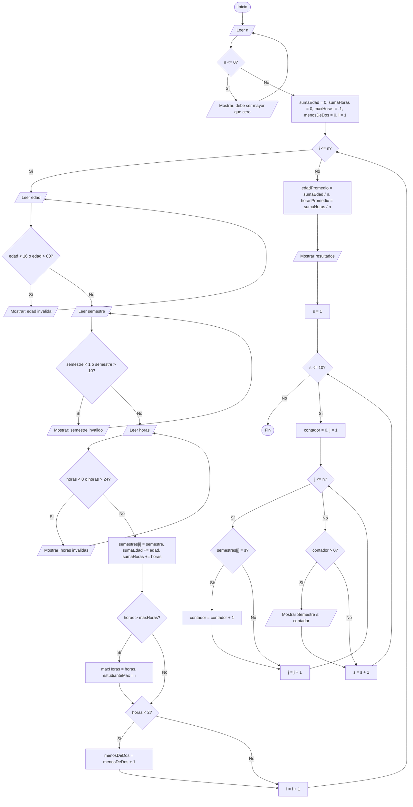

## Integrantes

- Francis Bonifaz
- Sebastian Navas
- David Punina
- Dixon Prado

## Objetivo

Desarrollar y fortalecer el conocimiento sobre el uso de ciclos en Java, aplicando estructuras repetitivas como `while`, `do-while` y `for` para resolver diferentes problemas mediante programas sencillos y prácticos.

## Descripción de los ejercicios

## Ejercicio 9. Estadísticas de una encuesta universitaria

Pregunte inicialmente cuántos estudiantes participarán.

Por cada estudiante solicitar:

```
Edad:
Semestre:
Horas de estudio por día:
```

Validaciones:

```
Edad: 16–80
Semestre: 1–10
Horas de estudio: 0–24
```

Determinar:

- edad promedio;
- horas promedio de estudio;
- estudiante con mayor cantidad de horas;
- estudiantes que estudian menos de 2 horas;
- cantidad de estudiantes por semestre.

Para el último requisito deberán utilizar ciclos anidados o una estrategia equivalente explicada por el estudiante.

### Estructuras utilizadas

| Estructura | Uso en el Ejercicio 9 |
| :--- | :--- |
| `while` | Validar que el número de estudiantes sea mayor que cero y que edad, semestre y horas estén dentro de su rango. |
| `for` | Recorrer los `N` estudiantes para leer y procesar sus datos. |
| `for` anidados | Ciclo externo por semestre (1 a 10) y ciclo interno por estudiante para contar cuántos hay en cada semestre. |
| `if` | Actualizar el estudiante con más horas y contar los que estudian menos de 2 horas. |
| Arreglo | `semestres[]` guarda el semestre de cada estudiante para contarlos al final. |
| Acumuladores | `sumaEdad` y `sumaHoras`. |
| Contadores | `menosDeDos` y `contador` (por semestre). |

**Caso límite obligatorio:** probar edades 16 y 80, semestres 1 y 10, horas 0 y 24 (válidos) y valores fuera de rango como edad 15, semestre 11 y horas 25 (inválidos).

**Estrategia para contar por semestre:** los semestres de todos los estudiantes se guardan en un arreglo. Al final, un ciclo `for` externo recorre los semestres del 1 al 10 y, por cada uno, un ciclo `for` interno recorre a todos los estudiantes y cuenta cuántos pertenecen a ese semestre. Solo se muestran los semestres que tienen al menos un estudiante.

### Análisis

**Entradas**

- Número de estudiantes `N` (debe cumplir `N > 0`).
- Por cada estudiante: `edad` (16 a 80), `semestre` (1 a 10) y `horas` de estudio por día (0 a 24).

**Restricciones y validaciones**

- Uso de la estructura `while` para validar `N > 0`.
- Uso de la estructura `while` para validar cada dato: `16 <= edad <= 80`, `1 <= semestre <= 10`, `0 <= horas <= 24`.

**Procesos**

- Acumular las edades y las horas para calcular los promedios.
- Comparar las horas de cada estudiante con la mayor registrada (`horas > maxHoras`) y guardar su número.
- Contar los estudiantes con `horas < 2`.
- Guardar el semestre de cada estudiante en el arreglo `semestres[]`.
- Contar estudiantes por semestre con ciclos `for` anidados.

**Salidas**

- Edad promedio.
- Horas promedio de estudio.
- Estudiante con mayor cantidad de horas (número y horas).
- Cantidad de estudiantes que estudian menos de 2 horas.
- Cantidad de estudiantes por semestre.

### Diagrama de flujo



### Pseudocódigo

```
Algoritmo EncuestaUniversitaria
    Definir n, i, s, edad, semestre, sumaEdad, estudianteMax, menosDeDos, contador Como Entero
    Definir horas, sumaHoras, maxHoras, edadPromedio, horasPromedio Como Real

    // Validación del número de estudiantes
    Escribir "Cuantos estudiantes participaran: "
    Leer n
    Mientras n <= 0 Hacer
        Escribir "El numero de estudiantes debe ser mayor que cero"
        Escribir "Cuantos estudiantes participaran: "
        Leer n
    FinMientras

    Dimension semestres[n]
    sumaEdad <- 0
    sumaHoras <- 0
    maxHoras <- -1
    estudianteMax <- 0
    menosDeDos <- 0

    // Lectura y procesamiento de cada estudiante
    Para i <- 1 Hasta n Con Paso 1 Hacer
        Escribir "--- Estudiante ", i, " ---"

        Escribir "Edad: "
        Leer edad
        Mientras edad < 16 O edad > 80 Hacer
            Escribir "Edad invalida. Debe estar entre 16 y 80"
            Escribir "Edad: "
            Leer edad
        FinMientras

        Escribir "Semestre: "
        Leer semestre
        Mientras semestre < 1 O semestre > 10 Hacer
            Escribir "Semestre invalido. Debe estar entre 1 y 10"
            Escribir "Semestre: "
            Leer semestre
        FinMientras

        Escribir "Horas de estudio por dia: "
        Leer horas
        Mientras horas < 0 O horas > 24 Hacer
            Escribir "Horas invalidas. Deben estar entre 0 y 24"
            Escribir "Horas de estudio por dia: "
            Leer horas
        FinMientras

        semestres[i] <- semestre
        sumaEdad <- sumaEdad + edad
        sumaHoras <- sumaHoras + horas

        Si horas > maxHoras Entonces
            maxHoras <- horas
            estudianteMax <- i
        FinSi

        Si horas < 2 Entonces
            menosDeDos <- menosDeDos + 1
        FinSi
    FinPara

    edadPromedio <- sumaEdad / n
    horasPromedio <- sumaHoras / n

    Escribir "Edad promedio: ", edadPromedio
    Escribir "Horas promedio de estudio: ", horasPromedio
    Escribir "Estudiante con mas horas: Estudiante ", estudianteMax, " (", maxHoras, " horas)"
    Escribir "Estudiantes que estudian menos de 2 horas: ", menosDeDos
    Escribir "Cantidad de estudiantes por semestre:"

    // Ciclos anidados: por cada semestre se recorren todos los estudiantes
    Para s <- 1 Hasta 10 Con Paso 1 Hacer
        contador <- 0
        Para i <- 1 Hasta n Con Paso 1 Hacer
            Si semestres[i] == s Entonces
                contador <- contador + 1
            FinSi
        FinPara
        Si contador > 0 Entonces
            Escribir "Semestre ", s, ": ", contador
        FinSi
    FinPara

FinAlgoritmo
```

### Casos de prueba

#### Prueba de escritorio — Ejercicio 9 (3 estudiantes, con datos inválidos incluidos)

| Paso | `i` | Entradas (edad, semestre, horas) | Validación | `sumaEdad` | `sumaHoras` | `maxHoras` | `estudianteMax` | `menosDeDos` |
| :--- | :---: | :---: | :--- | :---: | :---: | :---: | :---: | :---: |
| **Inicio** | - | `n = 0` → `n = 3` | 0 inválido, se vuelve a pedir; 3 válido | 0 | 0.0 | -1 | 0 | 0 |
| **Estudiante 1** | 1 | edad 15 → 18, sem 2, horas 5.0 | 15 inválido, se vuelve a pedir | 18 | 5.0 | 5.0 | 1 | 0 |
| **Estudiante 2** | 2 | edad 20, sem 11 → 2, horas 1.5 | 11 inválido, se vuelve a pedir | 38 | 6.5 | 5.0 | 1 | 1 |
| **Estudiante 3** | 3 | edad 25, sem 5, horas 25 → 8.0 | 25 inválido, se vuelve a pedir | 63 | 14.5 | 8.0 | 3 | 1 |
| **Fin del ciclo** | - | - | - | 63 | 14.5 | 8.0 | 3 | 1 |

Promedios: `edadPromedio = 63 / 3 = 21.00` y `horasPromedio = 14.5 / 3 = 4.83`.

#### Prueba de escritorio — Conteo por semestre (ciclos anidados)

`semestres[] = [2, 2, 5]`

| `s` (ciclo externo) | Recorrido interno (`semestres[i] == s`) | `contador` | Salida |
| :---: | :--- | :---: | :--- |
| 1 | 2≠1, 2≠1, 5≠1 | 0 | (no se muestra) |
| 2 | 2=2 ✔, 2=2 ✔, 5≠2 | 2 | `Semestre 2: 2` |
| 3 | 2≠3, 2≠3, 5≠3 | 0 | (no se muestra) |
| 4 | 2≠4, 2≠4, 5≠4 | 0 | (no se muestra) |
| 5 | 2≠5, 2≠5, 5=5 ✔ | 1 | `Semestre 5: 1` |
| 6 a 10 | ninguno coincide | 0 | (no se muestran) |

#### Casos de validación

| Caso | Entrada | Resultado esperado |
| :--- | :--- | :--- |
| N no válido | `n = 0` o `n = -1` | Muestra "El numero de estudiantes debe ser mayor que cero" y vuelve a pedirlo. |
| Edad fuera de rango | `edad = 15` o `edad = 81` | Muestra "Edad invalida" y vuelve a pedirla. |
| Edades límite | `edad = 16` y `edad = 80` | Se aceptan. |
| Semestre fuera de rango | `semestre = 0` o `semestre = 11` | Muestra "Semestre invalido" y vuelve a pedirlo. |
| Semestres límite | `semestre = 1` y `semestre = 10` | Se aceptan. |
| Horas fuera de rango | `horas = -1` o `horas = 25` | Muestra "Horas invalidas" y vuelve a pedirlas. |
| Horas límite | `horas = 0` y `horas = 24` | Se aceptan; 0 cuenta como "menos de 2 horas". |
| Exactamente 2 horas | `horas = 2` | **No** cuenta como "menos de 2 horas". |
| Empate en horas | Dos estudiantes con 8 horas | Se muestra el primero que las registró. |

### Capturas o evidencias

Salida de la ejecución con los datos de la prueba de escritorio (`Ejercicio09/Main.java`):

```
Cuantos estudiantes participaran: 0
El numero de estudiantes debe ser mayor que cero
Cuantos estudiantes participaran: 3

--- Estudiante 1 ---
Edad: 15
Edad invalida. Debe estar entre 16 y 80
Edad: 18
Semestre: 2
Horas de estudio por dia: 5

--- Estudiante 2 ---
Edad: 20
Semestre: 11
Semestre invalido. Debe estar entre 1 y 10
Semestre: 2
Horas de estudio por dia: 1.5

--- Estudiante 3 ---
Edad: 25
Semestre: 5
Horas de estudio por dia: 25
Horas invalidas. Deben estar entre 0 y 24
Horas de estudio por dia: 8

===================================
      RESULTADOS DE LA ENCUESTA
===================================
Edad promedio: 21.00
Horas promedio de estudio: 4.83
Estudiante con mas horas: Estudiante 3 (8.00 horas)
Estudiantes que estudian menos de 2 horas: 1
Cantidad de estudiantes por semestre:
  Semestre 2: 2
  Semestre 5: 1
```

CAPTURA


### Conclusiones

- El ciclo `while` permite validar varios datos por estudiante, obligando a que cada valor esté en su rango antes de continuar.
- El ciclo `for` es adecuado para procesar un número conocido de estudiantes, acumulando edades y horas para obtener los promedios.
- Los ciclos anidados permiten agrupar información: el ciclo externo recorre los semestres y el interno a los estudiantes, contando cuántos hay en cada uno.
- Guardar el semestre de cada estudiante en un arreglo hace posible volver a recorrer los datos después de haberlos leído.
